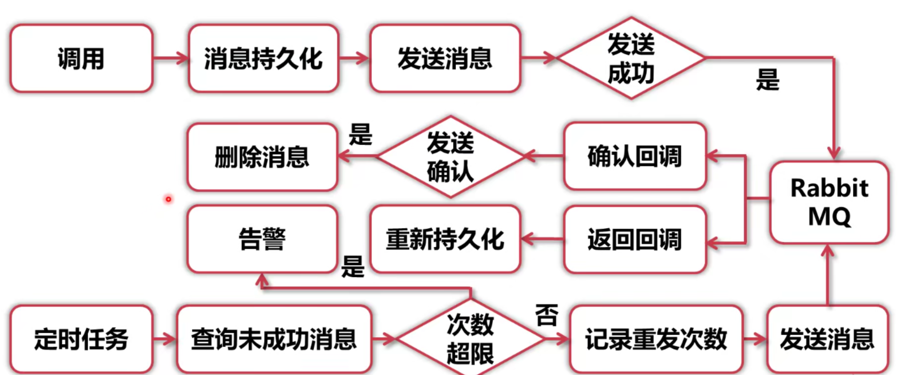
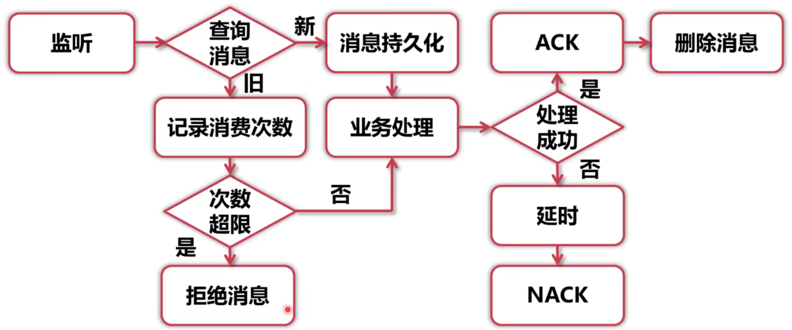
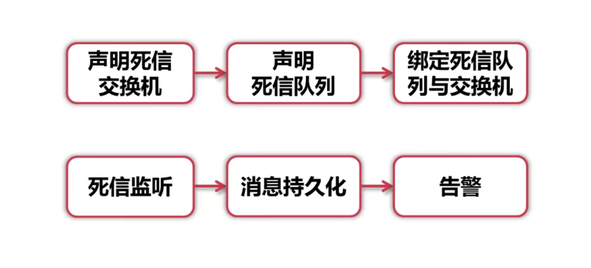

# RabbitMQ Stream 可靠消息投递，实现分布式事务消息，保证消息可靠发送的工作流Demo

## 工具及版本

- SpringBoot ```2.2.4.RELEASE```
- MybatisPlus ```3.5.2```
- RabbitMQ ```3.12.2```
- MySql ```8.0.32```

## 消息可靠性处理
- Producer
1. 使用RabbitMQ发送端确认机制，确认消息成功发送到MQ并被处理。
    - 单条同步确认
    - 多条同步确认
    - 异步确认
2. 使用RabbitMQ消息返回机制，若没发现目标队列，MQ会通知发送方

- Consumer
1. 使用RabbitMQ消费端确认机制，确认消息没有发送处理异常
   - 单条手动Ack
   - 多条手动Ack
   - NAck重回队列
2. 使用RabbitMQ消费端限流机制，不同机器处理能力有差异，限制消息推送速度，保障接收端服务稳定
   - 使用QoS功能保证在一定数目的消息未被确认前，不消费新的消息，前提是不使用AutoAck
   - QoS最大的作用是方便做横向扩展，在一个服务消费不过来时，另一个服务也可以去队列中取走消息去消费。如果不开启，所有消息都被一个服务抢占而不处于Ready状态，其他服务只能等待而不能消费。
   - QoS也可以减轻服务的压力

- MiddleWare

1. 大量消息堆积会给MQ产生巨大压力，需要使用RabbitMQ设置消息过期时间，防止消息大量积压
   - 解决队列爆满
   - 消息TTL：单条消息的过期时间
   - 队列TTL：队列中所有消息的过期时间
   - TTL应该明显长于服务的平均重启时间，防止在服务重启的时候消息超时
   - TTL应长于业务高峰期时间
2. 使用RabbitMQ死信队列，收集过期消息以供分析
   - 怎样变成死信：1.消息被reject/nack，且requeue=false 2.TTL 3.队列达到最大长度被丢弃
   - 消息过期后会被直接丢弃，无法对系统运行异常发出警告
   - 死信队列：队列配置了DLX属性（Dead-Letter-Exchange）
   - 当一个消息变成死信后，能重新被发布到另一个交换机上，经过路由后会进入一个固定的队列

## Spring AMQP 特性
1. 异步消息监听容器
2. RabbitTemplate收发消息
3. RabbitAdmin声明队列和交换机
4. SpringBootConfig支持RabbitMQ连接

## SimpleMessageListenerContainer

1.设置同时监听多个队列、自动启动、自动配置RabbitMQ

2.可设置消费者数量（最大数量、最小数量、批量消费）

3.设置消息确认模式、是否重回队列、异常捕获

4.设置是否独占、消费者属性

5.设置具体的监听器、消息转换器等

6.支持动态设置，运行中修改监听器的配置

## 设计模式

- 单例模式
- 适配器模式 MessageListenerAdapter

## Spring工具

- MessageConverter
- RabbitListener注解 可嵌套@Exchange @Queue @QueueBinding

## 分布式事务框架

### 传统事务 ACID 
1. 原子性
2. 一致性
3. 隔离性
4. 持久性

分布式事务无法满足原子性和隔离性
### 分布式事务
CAP无法同时满足 
- 一致性
- 可用性 
- 分区容忍性

BASE理论
- BA 基本可用
- Soft State 软状态
- Eventually consistent 最终一致性

### 消息发送失败重试
- 发送消息前消息持久化
- 发送成功时删除消息
- 定时检查未发送成功的消息，尝试重发
  

### 消费失败重试

- 收到消息时先持久化
- 消息处理成功，消费端手动Ack，删除消息
- 消息处理失败时，延时一段时间，不确认消息，记录重试次数，重回队列
- 再次处理消息
  

### 死信消息处理

- 声明死信队列、交换机、绑定
- 普通队列加入死信设置
- 监听到死信后，持久化处理，并设置告警
  


#### 系统框架
- 发送失败重试
- 消费失败重试
- 死信告警